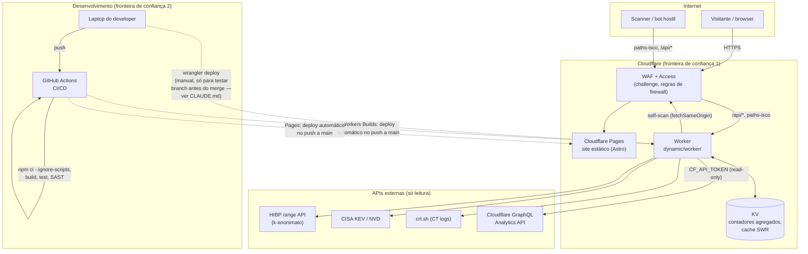

# Arquitetura

Visão de alto nível do sistema — o que fala com o quê, e onde ficam as
fronteiras de confiança. Complementa `README.md` (estrutura de pastas) e
`dynamic/PLAN.md` (decisões detalhadas do backend).

## Fronteiras de confiança

1. **Internet → Cloudflare.** Todo o tráfego de entrada passa pelo WAF/Access
   antes de chegar a Pages ou ao Worker. Nada na aplicação confia em headers
   de cliente sem validar (`normalizeCountry`, `normalizeAsn`, etc. em
   `sanitize.js`).
2. **GitHub → produção (Worker e Pages).** Ambos automáticos: push a `main`
   dispara o build/deploy do Pages (integração Git nativa da Cloudflare) e,
   em paralelo, o deploy do Worker via **Workers Builds** (a mesma
   integração Git, configurada no dashboard da Cloudflare — ver
   `docs/cloudflare-deploy.md` §4). Não há passo manual no caminho normal.
   Falta, ainda assim, o que o achado H3 de
   `docs/security-review-2026-07-29.md` pede: proveniência verificável entre
   commit e artefacto deployado (`attest-build-provenance`) e um gate de
   revisor num GitHub Environment — o Workers Builds automatiza o deploy,
   mas não dá nenhuma das duas coisas, porque corre inteiramente do lado da
   Cloudflare, fora do GitHub Actions. Existe também um caminho manual
   secundário (`npx wrangler deploy` a partir do laptop do developer),
   documentado em `CLAUDE.md` como forma de testar uma branch antes do
   merge — aponta para o mesmo Worker de produção se corrido sem cuidado.
3. **Worker → APIs externas.** Todas as chamadas são unidirecionais
   (o Worker só lê), com timeout (`AbortSignal.timeout`), e o self-scan usa
   `fetchSameOrigin` para nunca deixar as credenciais da Access seguirem um
   redirect para fora do domínio.

## Uma zona, dois caminhos de deploy

| | Trigger | Automatizado? |
| --- | --- | --- |
| `static/` (Pages) | push a `main` | Sim — integração Git nativa da Cloudflare |
| `dynamic/worker/` | push a `main` (Workers Builds) | Sim — mesma integração Git, configurada à parte no dashboard (ver `docs/cloudflare-deploy.md` §4) |

Os dois caminhos são automáticos, mas nenhum passa pelo GitHub Actions — a
lacuna real (achado H3) não é "deploy manual", é **ausência de proveniência
verificável e de um gate de revisor** entre o commit em `main` e o que fica a
correr na Cloudflare. Um `npx wrangler deploy` manual a partir do laptop
continua possível como via secundária (testar uma branch antes do merge,
`CLAUDE.md`) e aponta para o mesmo Worker de produção.
