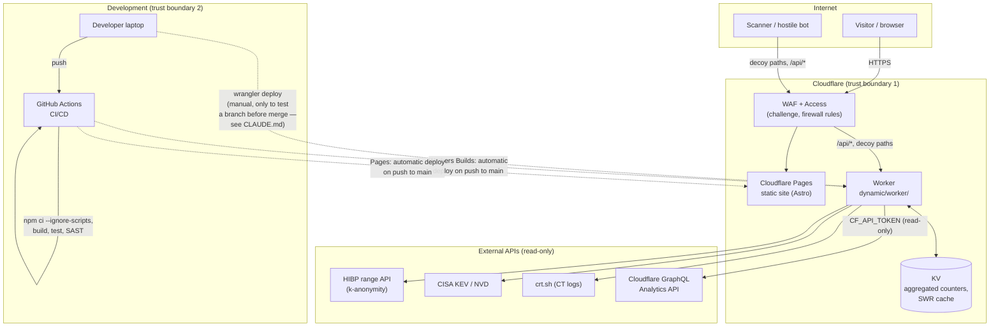

# Architecture

High-level view of the system — what talks to what, and where the trust
boundaries sit. Complements `README.md` (folder structure) and
`dynamic/PLAN.md` (detailed backend decisions).

## Trust boundaries

1. **Internet → Cloudflare.** All inbound traffic passes through WAF/Access
   before reaching Pages or the Worker. Nothing in the application trusts
   client headers without validating them (`normalizeCountry`,
   `normalizeAsn`, etc. in `sanitize.js`).
2. **GitHub → production (Worker and Pages).** Both automatic: a push to
   `main` triggers Pages' build/deploy (Cloudflare's native Git
   integration) and, in parallel, the Worker's deploy via **Workers
   Builds** (the same Git integration, configured separately in the
   Cloudflare dashboard — see `docs/cloudflare-deploy.md` §4). There's no
   manual step in the normal path; a secondary manual path exists
   (`npx wrangler deploy` from the developer's laptop, documented in
   `CLAUDE.md` as a way to test a branch before merging) that points at
   the same production Worker. The risk associated with this boundary
   (absence of verifiable provenance and a reviewer gate between commit
   and deploy) is recorded and kept current only in
   [`docs/threat-model.md`](threat-model.md) (finding H3, B2/B3) — not
   repeated here.
3. **Worker → external APIs.** All calls are one-directional (the Worker
   only reads), with a timeout (`AbortSignal.timeout`).

## One zone, two deploy paths

| | Trigger | Automated? |
| --- | --- | --- |
| `static/` (Pages) | push to `main` | Yes — Cloudflare's native Git integration |
| `dynamic/worker/` | push to `main` (Workers Builds) | Yes — same Git integration, configured separately in the dashboard (see `docs/cloudflare-deploy.md` §4) |

Both paths are automated, but neither goes through GitHub Actions — see
[`docs/threat-model.md`](threat-model.md) (finding H3) for what that gap
implies and the current status.
