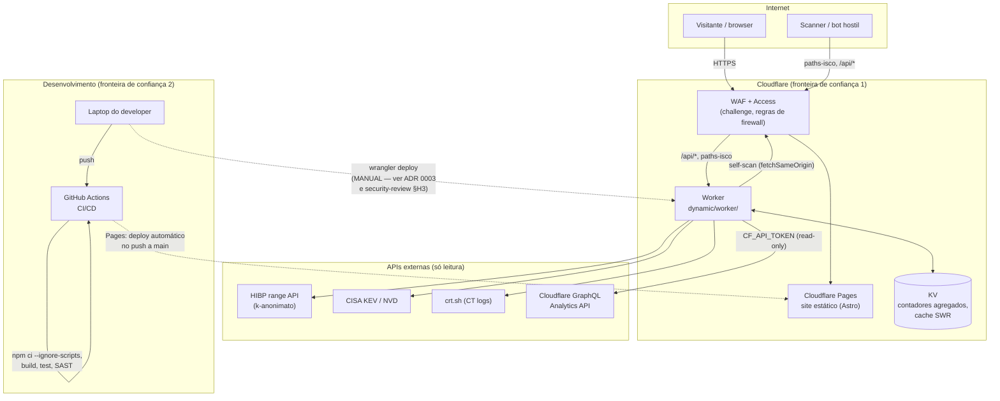

# Arquitetura

Visão de alto nível do sistema — o que fala com o quê, e onde ficam as
fronteiras de confiança. Complementa `README.md` (estrutura de pastas) e
`dynamic/PLAN.md` (decisões detalhadas do backend).

## Fronteiras de confiança

1. **Internet → Cloudflare.** Todo o tráfego de entrada passa pelo WAF/Access
   antes de chegar a Pages ou ao Worker. Nada na aplicação confia em headers
   de cliente sem validar (`normalizeCountry`, `normalizeAsn`, etc. em
   `sanitize.js`).
2. **Laptop do developer → produção.** A única fronteira sem controlo
   automatizado hoje: o deploy do Worker é manual (`npx wrangler deploy`).
   O Pages é automático (push a `main` → build → deploy), mas o Worker não
   tem esse mesmo caminho — ver `docs/security-review-2026-07-29.md` (achado
   H3) para o plano de fechar esta lacuna com um Environment do GitHub +
   token com escopo mínimo + `attest-build-provenance`.
3. **Worker → APIs externas.** Todas as chamadas são unidirecionais
   (o Worker só lê), com timeout (`AbortSignal.timeout`), e o self-scan usa
   `fetchSameOrigin` para nunca deixar as credenciais da Access seguirem um
   redirect para fora do domínio.

## Uma zona, dois caminhos de deploy

| | Trigger | Automatizado? |
| --- | --- | --- |
| `static/` (Pages) | push a `main` | Sim — integração Git nativa da Cloudflare |
| `dynamic/worker/` | `npx wrangler deploy` a partir do laptop | Não (ver acima) |

Isto não é uma inconsistência acidental — está documentado em
`dynamic/PLAN.md` e no topo de `wrangler.toml` como o fluxo atual ("validar
com o fluxo já documentado no CLAUDE.md antes de fazer merge"). É, no
entanto, a maior lacuna de proveniência do repositório, e fica assinalada
como tal.
